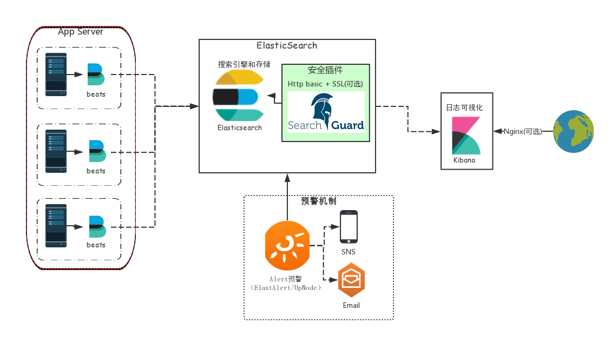

# 基于ElasticSearch的日志分析框架   
      
> 满足日志收集，监控，检索，预警等。   
  
## 初步需求    
*  [x] 要具备显示调用方文件名和行号的能力  
*  [x] 记录日志完整堆栈
*  [x] 要有按请求/用户聚合的能力，便于查流水 
*  [ ] _要有染色能力，指定用户能log全开，实时定位问题_
*  [ ] _能还原成fiddler抓包，重现现场（对于偶发性问题比较重要）_  
*  [ ] _要具备单机调试的功能，可以不停机编写条件开启指定log，无视日志级别_
*  [x] 日志收集能力
*  [x] 日志监控能力（日志内容、服务器指标）
*  [x] 可视化日志分析界面
*  [x] 日志预警机制（短信、邮件、微信）  

## 总体方案      
主要还是采用`Elastic Stack 5`(以前被称呼为`ELK`)平台。
* `node-app`日志记录组件 - `bunyan-node`
* 日志抓取 - `beats(Filebeat/Metricbeat/Packetbeat/Heartbeat)`  
* 日志搜索引擎 - `Elasticsearch`  
* 日志可视化 - `kibana`  
* 日志预警 - `UPNode/ElastAlert`  

  
## 内容  
* 一、[技术选型过程](wikis/log-option.MD) 
* 二、[Elastic Stack 5]  
	- [Elasticsearch + Kibana + FileBeat 安装配置](wikis/elk-install.MD)
	- [Beats安装配置(Metricbeat,Packetbeat,Heartbeat)](wikis/beats-install.MD)
	- [Beats介绍(Metricbeat,Packetbeat,Heartbeat)](wikis/beats.md)
	- [Elasticsearch集群说明及安装部署](wikis/elasticsearch-cluster.MD)  
	- [Elasticsearch性能优化建议](wikis/elk-performance.MD)  
* 三、[ELK日志预警方案]  
	- ~~[官方插件x-pack(部分商业授权)](https://www.elastic.co/products/x-pack)~~
	- ~~ElastAlert预警插件安装配置(可选方案)~~
		* [ElastAlert安装配置及Email预警](wikis/elastalert-install.MD)
		* [ElastAlert-企业微信预警](wikis/elastalert-install.MD) 
	- Node.js-Elasticsearch-Alert组件 
* 四、[ELK平台安全性]  
	- [Elk日志平台安全策略](wikis/elk-security.MD)  
	- [Elasticsearch-search gurad 5插件](wikis/searchguard.MD)  
* 五、[Elastic Stack 使用]  
	- [快速使用](wikis/elk-use.MD)
* 六、[Node.js日志组件]
	- [bunyan,log4js,winston在npm的对比](https://npmcompare.com/compare/bunyan,log4js,winston)    
	- [bunyan,winston对比](https://strongloop.com/strongblog/compare-node-js-logging-winston-bunyan/)
	- [异常处理规范](wikis/exception.md)
	- [日志调用及输出约定](wikis/log-contrat-bunyan.MD)
	- [日志存储策略](wikis/logrotate.md)
	- Elasticsearch索引模板定制

	

