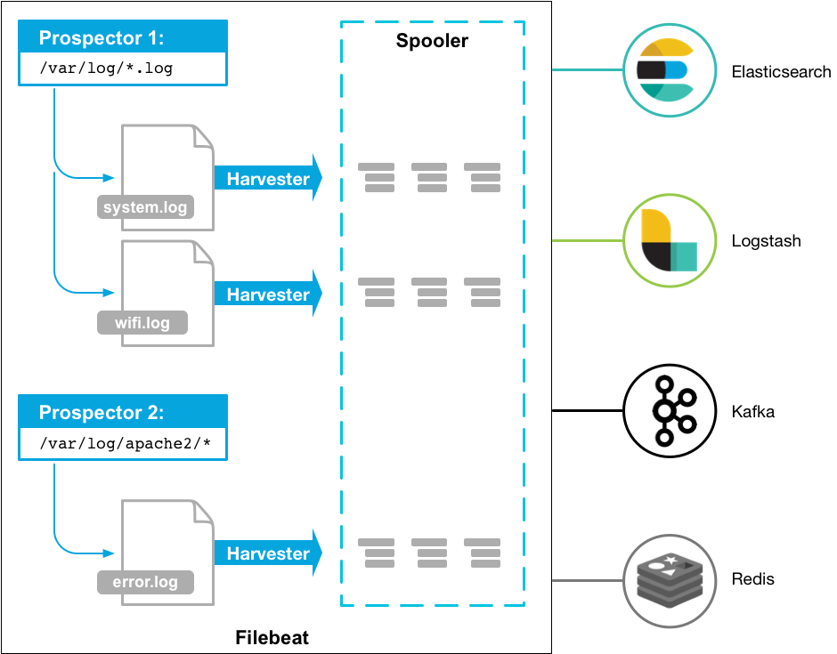
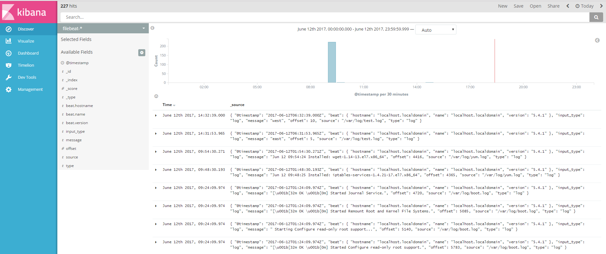
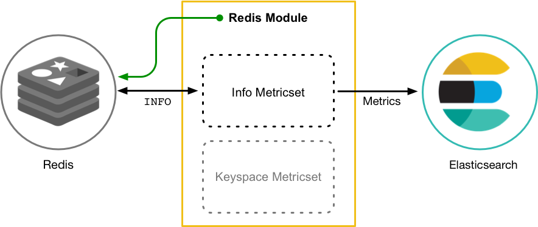
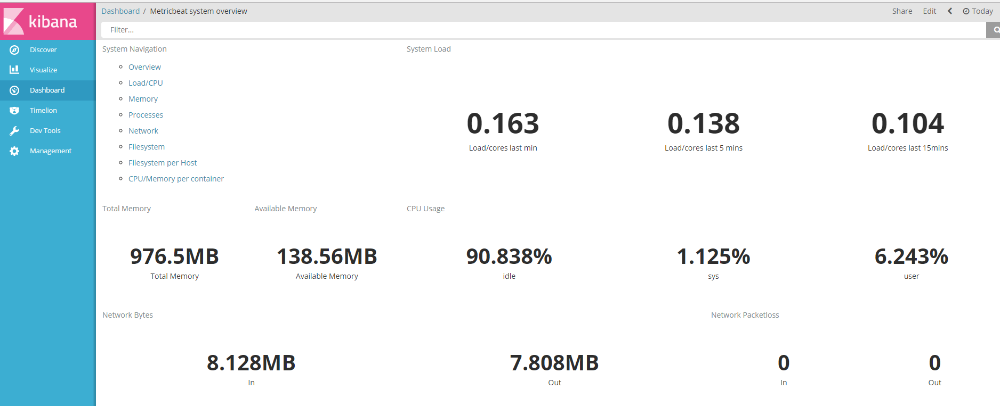
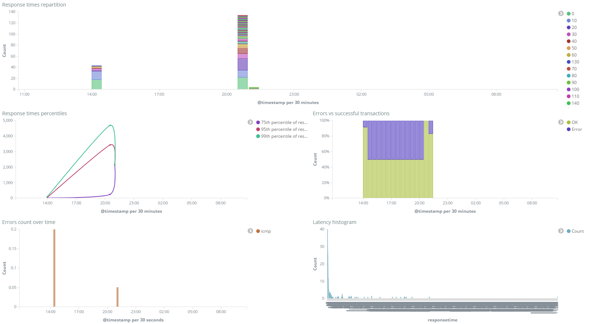
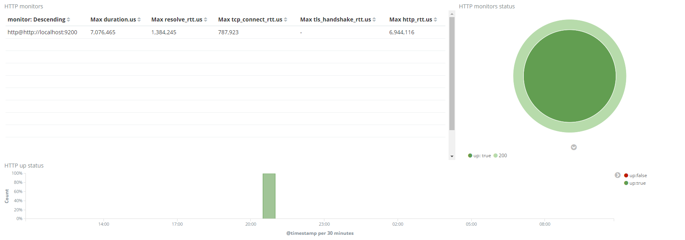

# Beats

Beats是elasticsearch公司开源的一款采集系统监控数据的代理agent，它可以发送不同类型的数据到elasticsearch中，也可以行将采集完的数据发送到logstash中转，其中抽象出来的 libbeat，提供了统一的数据发送方法，输入配置解析，日志记录框架等功能，具有轻量，灵活的特点。

Beats目前包含Filebeat(文件log的监控采集)、Metricbeat(性能指标监控采集)、Packetbeat(网络流量监控采集)、Heartbeat(健康监控采集)和Winlogbeat(Windows系统log监控采集)。

## Filebeat

---

Filebeat包含Prospector和Harvester两块组件,就是它们的相互协作才能搜集日志，发送数据到指定的输出。

#### Prospector
Prospector表示哪些资源可以收集和管理Harvesters，它有log和stdin两种类型。

    filebeat.prospectors:  
    
      - input_type: log  
      paths:
        - /var/log/*.log 
        - /var/path2/*.log  
        

转换成json

	{
	  'filebeat.prospectors': [
		{
		  input_type: 'log',
		  paths: [
			'/var/log/*.log',
			'/var/path2/*.log'
		  ]
		}
	  ]
	}

#### Harvester
Harvester表示从一个文件中读取内容,一个文件对应一个harvester,它是一行一行的读并将读到的内容发送到输出的，当harvester运行时，如果一个文件被删除或者被重命名，Filebeat还会继续读取这个文件的，因为filebeat存储一个唯一标识符来识文件，而不是文件名和路径。

#### Filebeat工作原理
每个文件都需要记录harvester最近一次读取的位置和保证所有已经搜集的都被发送了的状态，这个状态被Filebeat保存到注册文件中，并且这个注册文件频繁地刷新到磁盘上。例如Elastisearch挂掉了，Filebeat将继续追踪最后一行而且只要Elastisearch只要上线就继续读取此文件发送数据。由于注册文件的存在Filebeat会确保所有数据至少一次被发送到配置文件指定的输出上并且没有丢失。例如Elastisearch阻塞了，Filebeat会一直尝试发送数据，直到收到数据被接收的确认。

#### 配置示例

    filebeat:
	    spool_size: 1024# 最大可以攒够 1024 条数据一起发送出去
	    idle_timeout: "5s"  # 否则每 5 秒钟也得发送一次
	    registry_file: ".filebeat"  # 文件读取位置记录文件，会放在当前工作目录下。所以如果你换一个工作目录执行 filebeat 会导致重复传输！
	    config_dir: "path/to/configs/contains/many/yaml"# 如果配置过长，可以通过目录加载方式拆分配置
	    prospectors:# 有相同配置参数的可以归类为一个 prospector
		    - fields:
		    		ownfield: "mac" # 类似 logstash 的 add_fields
			    paths:
			   		- /var/log/system.log   # 指明读取文件的位置
			    	- /var/log/wifi.log
			    	include_lines: ["^ERR", "^WARN"]# 只发送包含这些字样的日志
			    	exclude_lines: ["^OK"]  # 不发送包含这些字样的日志
		    - document_type: "apache" # 定义写入 ES 时的 _type 值
			    ignore_older: "24h" # 超过 24 小时没更新内容的文件不再监听。在 windows 上另外有一个配置叫 
			    scan_frequency: "10s"   # 每 10 秒钟扫描一次目录，更新通配符匹配上的文件列表
			    tail_files: false   # 是否从文件末尾开始读取
			    paths:
			    	- "/var/log/apache/*"   # 可以使用通配符
			    exclude_files: ["/var/log/apache/error.log"]
		    - input_type: "stdin" # 除了 "log"，还有 "stdin"
			    multiline:  # 多行合并
				    pattern: '^\['
				    negate: false
				    match: after

扫描频率

    scan_frequency: 10s

忽略老文件

    ignore_older: 2h
 

多行合并

    multiline.pattern: '^\['
    multiline.negate: true
    multiline.match: after

    [beat-logstash-some-name-832-2015.11.28] IndexNotFoundException[no such index]
    	at org.elasticsearch.cluster.metadata.IndexNameExpressionResolver$WildcardExpressionResolver.resolve(IndexNameExpressionResolver.java:566)
    	at org.elasticsearch.cluster.metadata.IndexNameExpressionResolver.concreteIndices(IndexNameExpressionResolver.java:133)
    	at org.elasticsearch.cluster.metadata.IndexNameExpressionResolver.concreteIndices(IndexNameExpressionResolver.java:77)
    	at org.elasticsearch.action.admin.indices.delete.TransportDeleteIndexAction.checkBlock(TransportDeleteIndexAction.java:75)

Elasticsearch

    output.elasticsearch:
      hosts: ["http://localhost:9200"]
      template.enabled: true
      template.path: "filebeat.template.json"
      template.overwrite: false
      index: "filebeat"
      ssl.certificate_authorities: ["/etc/pki/root/ca.pem"]
      ssl.certificate: "/etc/pki/client/cert.pem"
      ssl.key: "/etc/pki/client/cert.key"
    

#### 启动
  
    ./scripts/import_dashboards

    ./filebeat 

#### 发送字段

- beat.hostname beat 运行的主机名
- beat.name shipper 配置段设置的 name，如果没设置，等于 beat.hostname
- @timestamp 读取到该行内容的时间
- type 通过 document_type 设定的内容
- input_type 来自 "log" 还是 "stdin"
- source 具体的文件名全路径
- offset 该行日志的起始偏移量
- message 日志内容
- fields 添加的其他固定字段都存在这个对象里面

#### Processors

    processors:
	    - drop_event:
		    when:
			    regexp:
			       message: "^DBG:"

#### 展示

## Metricbeat

Metricbeat可以收集操作系统，Apache，HAProxy，Nginx，MySQL，Redis，MongoDB，PostgreSQL，Zookeeper性能指标，其它需要收集的可以按照规范自己写

#### Metricbeat工作原理

Metricbeat由modules和metricsets组成，module定义了怎么连接，每隔多久收集次指标，收集哪些指标，每个module包含一个或多个metricset，metricset表示抓取数据并结构化。例如Redis module提供的info metricset就是通过运行 info 命令，解析返回结果来收集信息和统计，MySQL module提供的status metricset就是通过运行 SHOW GLOBAL STATUS SQL查询收集数据。

Metricbeat是异步发送事件的，当配置的输出不可用时，事件有可能丢失。当Metricbeat发生错误时会向输出发送error事件，我们可以通过监控错误来查看调试信息定位那个服务出错了。

    {
      "@timestamp": "2016-03-18T12:18:57.124Z",
      "apache-status": {},
      "beat": {
		  "hostname": "host.example.com",
		  "name": "host.example.com"
	  },
	  "error": "Get http://127.0.0.1/server-status?auto: dial tcp 127.0.0.1:80: getsockopt: connection refused",
	  "metricset": {
		  "module": "apache",
		  "name": "status",
		  "rtt": 1082
	  },
	  .
	  .
	  .
	
	  "type": "metricsets"

#### 配置示例

    metricbeat.modules:
	    - module: system
	      metricsets:
		      - cpu
		      - filesystem
		      - memory
		      - network
		      - process
	      enabled: true
	      period: 10s
	      processes: ['.*']
	      cpu_ticks: false
	    - module: apache
	      metricsets: ["status"]
	      enabled: true
	      period: 1s
	      hosts: ["http://127.0.0.1"]
#### 展示

## Packetbeat

Packetbeat是一个实时的网络包分析器，和Elasticsearch搭配可以用来监控和分析系统
Packetbeat支持的网络协议有：HTTP，MySQL，PostgreSQL，Redis，Thrift，DNS，MongoDB，Memcache

#### 配置示例

    interfaces:
	    device: any
	    type: af_packet
	    snaplen: 65536   # 保证大过 MTU 即可，所以公网抓包的话可以改成 1514
	    buffer_size_mb: 30   # 该参数仅在 af_packet 时有效，表示在 linux 内核空间和用户空间之间开启多大共享内存，可以减低 CPU 消耗
	    with_vlans: false# 在生成抓包语句的时候，是否带上 vlan 标示。示例："port 80 or port 3306 or (vlan and (port 80 or port 3306))"
    protocols:
	    http:
		    ports: [80, 8080]# 抓包的监听端口
		    hide_keywords: ["password","passwd"] # 对 GET 方法的请求参数，POST 方法的顶层参数里的指定关键信息脱敏。注意：如果又开启了 send_request，request 字段里的并不会脱敏"
		    redact_authorization: true   # 对 header 中的 Authorization 和 Proxy-Authorization 内容做模糊处理。道理和上一条类似
		    send_headers: ["User-Agent"] # 只在 headers 对象里记录指定的 header 字段内容
		    send_all_headers: true   # 在 headers 对象里记录所有 header 字段内容
		    include_body_for: ["text/html"]  # 在开启 send_response 的前提下，只记录某些类别的响应体内容
		    split_cookie: true   # 将 headers 对象里的 Cookie 或 Set-Cookie 字段内容再继续做 KV 切割
		    real_ip_header: "X-Forwarded-For"# 将 headers 对象里的指定字段内容设为 client_location 和 real_ip 字段

#### 展示

## Heartbeat

Heartbeat可以检查服务的是否可用或可达，不像Metricbeat那样告诉服务是否宕机，为了检测hosts Heartbeat目前支持ICMP,TCP和HTTP三种方式监控。和其它Beats安装在服务同一台机器不一样，Heartbeat应该尽可能安装在和监控的服务不在同一个网络的别的机器上。

#### 配置示例

    heartbeat.monitors:
    - type: icmp
      schedule: '*/5 * * * * * *' 
      hosts: ["localhost"]
    - type: tcp
      schedule: '@every 5s' 
      hosts: ["localhost:12345"]
      mode: any 

#### 展示

