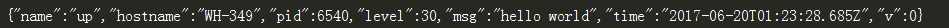
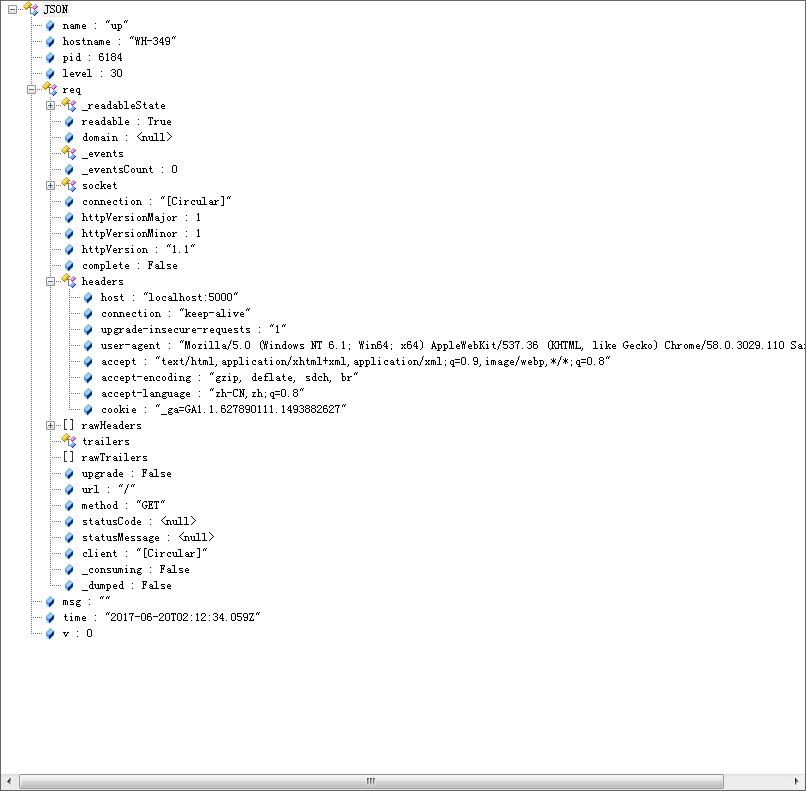
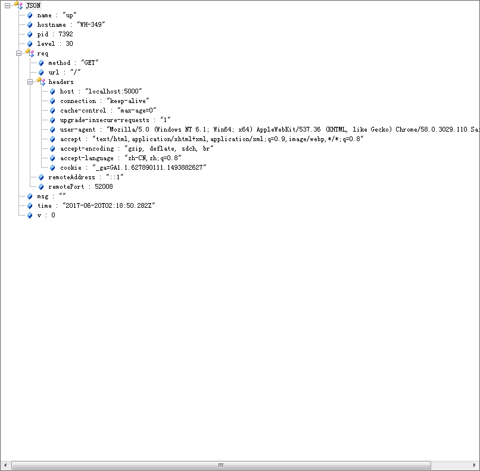

## bunyan

一个Node.js简单快速的json日志库

### 示例

    let bunyan = require('bunyan');
    let log = bunyan.createLogger({name: "up"});
    log.info("hello world");
输出

### 特性

- log方法，trace(10)，debug(20)，info(30)，warn(40)，error(50)，fatal(60)
- 流Streams，steam，file，rotating-file，raw
- Serializers
- log.child
- pretty printing

#### log

log有trace(10)，debug(20)，info(30)，warn(40)，error(50)，fatal(60)六种级别，设置info级别，warn，error，fatal也会输出，日志也可以使用 `%s`进行格式化，如果想在输出的json第一级别显示字段，第一个参数可以传对象，但不应该`log.info(obj, 'hi')`这样，以免覆盖默认的字段，而应该`log.info({obj: obj}, 'hi')`这样。

    log.info('hi'); // Log a simple string message (or number). 
    log.info('hi %s', 'up', 'china'); // Uses `util.format` for msg formatting. 
    log.info({foo: 'bar'}, 'hi');

#### Steams

Streams包含stream，file，rotating-file，raw四种类型，bunyan为了简便如果是只有一个steam类型，可以不用写steams而直接在外层写steam。 rotating-file中type和path是必须，其它可选，period默认1天，count默认10个，period值为`$number$scope`,`$scope`可取`ms`(仅用于测试),`h`(hours),`d`(days),`w`(weeks),`m`(months),`y`(years)。

    let log = bunyan.createLogger({
      name: 'up',
      level: 'info',
      src: 'true',
      streams: [
        {
          level: 'info',
          type: 'stream',
    	  stream: process.stdout // log INFO and above to stdout
    	},
    	{
    	  level: 'error',
          type: 'file',
    	  path: '/var/tmp/myapp-error.log'  // log ERROR and above to a file
    	},
        {
          type: 'rotating-file',
          path: '/var/log/foo.log',
          period: '1d',   // daily rotation 
          count: 3        // keep 3 back copies 
        }
      ],
      des: 'this is description'
    });
    
#### Serializers

Bunyan在格式化整个对象时有两个问题:

 1 循环引用（Circular references）

 2 多余的数据（Unwanted noises）

为了处理这两个问题，Bunyan有一个序列化器的概念，基本上就是一些转换函数，把对象转换为部分字段的输出格式.

    let bunyan = require('bunyan');
    let Koa = require('koa');
    let app = new Koa();
    
    var log = bunyan.createLogger({
    //    serializers: bunyan.stdSerializers,
        name: 'up'
    });
    
    app.use(ctx => {
        log.info({req: ctx.req});
        ctx.body = 'Hello Koa';
    });
    
    app.listen(5000);

after

#### log.child

Bunyan有一个子日志的概念，这允许为你的应用程序的某个子组件指定日志实例。也即是，创建一个新的日志实例使得可以处理额外的字段。
子日志通过log.child(...)方法创建。这为记录系统、请求以及简单函数这些不同作用域的组件日志带来极大的方便。

    let bunyan = require('bunyan');
    let log = bunyan.createLogger({name: 'up'});
    
    function Child(options) {
        this.log = options.log.child({widget_type: 'child'});
        this.log.info('creating a child log')
    }
    Child.prototype.test = function () {
        this.log.warn('This is child log.')
    }
    
    log.info('start');
    let child = new Child({log: log});
    child.test();
    log.info('done');
    
    {"name":"up","hostname":"WH-349","pid":7988,"level":30,"msg":"start","time":"2017-06-20T02:33:09.002Z","v":0}
    {"name":"up","hostname":"WH-349","pid":7988,"widget_type":"child","level":30,"msg":"creating a child log","time":"2017-06-20T02:33:09.004Z","v":0}
    {"name":"up","hostname":"WH-349","pid":7988,"widget_type":"child","level":40,"msg":"This is child log.","time":"2017-06-20T02:33:09.004Z","v":0}
    {"name":"up","hostname":"WH-349","pid":7988,"level":30,"msg":"done","time":"2017-06-20T02:33:09.004Z","v":0}

#### pretty printing

由于json格式人不容易阅读，调试时我们可以使用`node_modules/.bin/bunyan`来美化输出

#### requestId

bunyan不支持记录请求详情和requestId，`koa-bunyan-logger`提供了这两个功能，我们可以加以整合，以下是`koa-bunyan-logger`中添加requestId源码

    module.exports.requestIdContext = function (opts) {
      opts = opts || {};
    
      var header = opts.header || 'X-Request-Id';
      var ctxProp = opts.prop || 'reqId';
      var requestProp = opts.requestProp || 'reqId';
      var logField = opts.field || 'req_id';
      var fallbackLogger;
    
      return function requestIdContext(ctx, next) {
        var reqId = ctx.request.get(header) || uuid.v4();
    
        ctx[ctxProp] = reqId;
        ctx.request[requestProp] = reqId;
    
        var logFields = {};
        logFields[logField] = reqId;
    
        if (!ctx.log) {
          throw new Error('must use(koaBunyanLogger()) before this middleware');
        }
    
        ctx.log = ctx.log.child(logFields);
    
        return next();
      };
    };

## 日志约定

记录日志的原则是判断应用是否符合预期和出错能快速进行定位问题。

1. 对于应用程序，推荐约定存储在一个统一的位置（比如`/var/log/${projectName}`），这样方便`filebeat`或者`logstash`去拉取。
2. 应用程序中，推荐至少记录`info`和`error`日志，并且分别命名两个文件（比如${projectName}_info_20170620.log和${projectName}_error_20170620.log}，`debug`可以在开发或测试环境中使用，生产环境一般不使用。`info`是bunyan默认日志级别，一般记录应用调用轨迹或关键信息，以便应用出错时方便跟踪定位问题，`error`表示应用出错或者异常信息，要引起特别重视。
3. 日志存储策略可以根据每个应用自身日志输出大小和重要度进行配置，对于一般应用的`info`日志，推荐至少保留一个月日志，`error`日志保留三个月。
4. 日志记录格式也可以根据具体应用而定，重要信息一般是必须记录的，比如userId，orderId，requestId等等。

#### 参考链接
1. [npm bunyan](https://www.npmjs.com/package/bunyan)
2. [npm koa-bunyan-logger](https://www.npmjs.com/package/koa-bunyan-logger)
3. [Node.js日志框架选型比较：Bunyan](http://blog.csdn.net/iefreer/article/details/34487125)