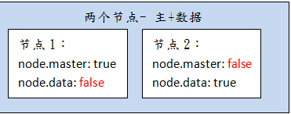
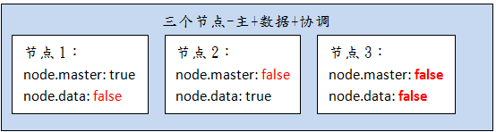
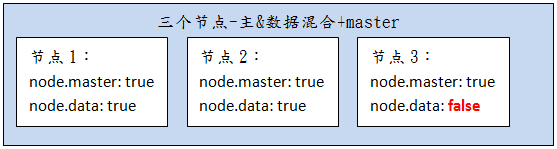
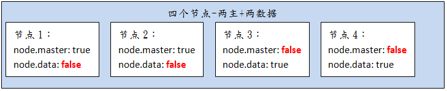
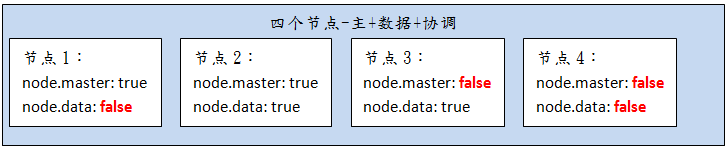

# Elasticsearch 5 集群环境      
  
一个运行中的 Elasticsearch 实例称为一个节点，而集群是由一个或者多个拥有相同 cluster.name 配置的节点组成，  
它们共同承担数据和负载的压力。当有节点加入集群中或者从集群中移除节点时，集群将会重新平均分布所有的数据。

当一个节点被选举成为 主 节点时， 它将负责管理集群范围内的所有变更，例如增加、删除索引，或者增加、删除节点等。   
而主节点并不需要涉及到文档级别的变更和搜索等操作，所以当集群只拥有一个主节点的情况下，即使流量的增加它也不会成为瓶颈。 任何节点都可以成为主节点。我们的示例集群就只有一个节点，所以它同时也成为了主节点。  
作为用户，我们可以将请求发送到 集群中的任何节点 ，包括主节点。 每个节点都知道任意文档所处的位置，并且能够将我们的请求直接转发到存储我们所需文档的节点。   
无论我们将请求发送到哪个节点，它都能负责从各个包含我们所需文档的节点收集回数据，并将最终结果返回給客户端。 Elasticsearch 对这一切的管理都是透明的。  

## 此文档环境  
* Centos 7  
* Elasticsearch 5.4.1   
* Search guard(可选)  
* 单机VM（承载不同实例节点）  

## 集群主要配置说明  
* 节点说明  
	- Master eligible node(可选主节点)    
	```  
	node.master: true
	```
	主节点负责轻量级集群范围内的操作，例如创建或删除索引、跟踪集群节点状态，以及决定将哪些节点分配给哪个节点。对于集群健康来说，有一个稳定的主节点是很重要的。  
	
	- Data node(数据节点)   
	```  
	node.data: true	
	```
	数据节点持有数据分片。数据节点处理与数据相关的操作，如CRUD、搜索和聚合。这些操作是I / O ，内存和cpu密集型。对这些资源进行监视并在其超载时添加更多的数据节点是非常重要的。  
	
	- Ingest node(管道节点)     
	```  
	node.ingest: true
	```	
	5+以上版本新增的节点概念，可以执行预处理管道，ingest设置为(默认)true。  
	Ingest节点能够为文档应用最重要的管道，以便在索引之前转换和结构化文档。使用超负载时，可以选择使用专用的ingest节点，并将master节点和data节点的ingest标记为false是比较有意义的。

	- Coordinating node(路由节点)  
	```  
	node.master: false 
	node.data: false 
	node.ingest: false 
	search.remote.connect: false	
	``` 
	  
* 其他配置   
   
```   shell    
############################## Network And HTTP ###############################

# 设置绑定的ip地址,可以是ipv4或ipv6的,默认为0.0.0.0
#network.bind_host: 192.168.0.1

# 设置其它节点和该节点交互的ip地址,如果不设置它会自动设置,值必须是个真实的ip地址
#network.publish_host: 192.168.0.1

# 同时设置bind_host和publish_host上面两个参数
#network.host: 192.168.0.1

# 设置节点间交互的tcp端口,默认是9300
#transport.tcp.port: 9300

# 设置是否压缩tcp传输时的数据，默认为false,不压缩
#transport.tcp.compress: true

# 设置对外服务的http端口,默认为9200
#http.port: 9200

# 设置请求内容的最大容量,默认100mb
#http.max_content_length: 100mb

# 使用http协议对外提供服务,默认为true,开启
#http.enabled: false  

################################# Discovery ##################################
# 设置这个参数来保证集群中的节点可以知道其它N个有master资格的节点.默认为1,对于大的集群来说,可以设置大一点的值(2-4)
#discovery.zen.minimum_master_nodes: 1

# 探查的超时时间,默认3秒,提高一点以应对网络不好的时候,防止脑裂
#discovery.zen.ping.timeout: 3s  

# 设置是否打开多播发现节点.默认是true.
# 当多播不可用或者集群跨网段的时候集群通信还是用单播吧
#discovery.zen.ping.multicast.enabled: false  

# 这是一个集群中的主节点的初始列表,当节点(主节点或者数据节点)启动时使用这个列表进行探测
#discovery.zen.ping.unicast.hosts: ["host1", "host2:port"]    

############################# Recovery Throttling #############################

# 下面这些配置允许在初始化恢复,副本分配,再平衡,或者添加和删除节点时控制节点间的分片分配
# 设置一个节点的并行恢复数

# 1.初始化数据恢复时,并发恢复线程的个数,默认为4
#cluster.routing.allocation.node_initial_primaries_recoveries: 4
#
# 2.添加删除节点或负载均衡时并发恢复线程的个数,默认为2
#cluster.routing.allocation.node_concurrent_recoveries: 2

# 设置恢复时的吞吐量(例如:100mb,默认为0无限制.如果机器还有其他业务在跑的话还是限制一下的好)
#indices.recovery.max_bytes_per_sec: 20mb

# 设置来限制从其它分片恢复数据时最大同时打开并发流的个数,默认为5
#indices.recovery.concurrent_streams: 5

# 注意: 合理的设置以上参数能有效的提高集群节点的数据恢复以及初始化速度

  
```

 
## 集群部署结构    
集群应该怎样部署，选择几个节点，需要结合实际情况进行合理分配,这里只是提供几种选择方案供理解。  
不同节点数，特别要注意`discovery.zen.minimum_master_nodes`的设置问题
### 2个节点       
* 2.1 master & data 混合     
这是最简单的环境，但其实属于按功能负载，并不能处理单点故障(结合`minimum_master_nodes`分析)。  


* 2.2 master / data 分离  
同上，也只是简单的按功能负载。   
 

### 3个节点   
* 3.1 master / data / coordinating    
也只是简单的按功能负载, 按职责分：一个`master`、一个`data`、一个协调节点。  

* 3.2 master & data 混合 + master     
 此方案有负载和单点故障能力，但1,2节点的压力会比较大，一般没有高并发高负载的应用，可采用此种方式。  
 之后的安装部署过程，也会按这个方式来：
 

 
### 4个节点    
* 4.1 2 master & 2 data     

* 4.2 master / data / coordinating    


## 脑裂现象    
> 假设有一个由两个主节点组成的集群。网络故障中断了这两个节点之间的通信。每个节点本身只看到一个master-eligible节点（即自己）。又因为`minimum_master_nodes`的默认值为`1`，这就足够形成一个集群。每个节点都选择自己作为新master(认为另一个主节点已经死亡)，结果是两个集群，或者是一个分裂的大脑。  
这两个节点将永远不会重新连接，直到重新启动一个节点。已经写入到重启节点的任何数据都将丢失。  

__解决脑裂现象的办法__:  
> 推荐设置discovery.zen.minimum_master_nodes的值为(master_eligible_nodes / 2) + 1 
现在假设有一个具有三个master-eligible节点的集群，以及将最小um_master_nodes设置为2。  
如果一个网络将一个节点与其他两个节点分隔开，那么有一个节点的一方无法看到足够的主节点，并且会意识到它不能选择自己作为主节点。  
有两个节点的一方将会选择一个新的主(如果需要的话)，并继续正确运行。一旦网络分裂得到解决，单个节点将重新连接到集群并再次开始服务请求  

__所以，一般如果要组建Elasticsearch的集群，数据和访问量不大，使用3台宿主形成集群的话，推荐使用上述`3.2方案`。__

## 安装配置过程        

以下采用`3.2方案`进行安装配置，集群的整个安装配置过程比较简单，具体如下：   
### 1. 前置条件  
* 已安装Elasticsearch 5.4.1单节点  
* 已在单节点内成功部署Search guard插件  
   
### 2. 节点1配置        
编辑`elasticsearch.yml`文件：  

```    
# Use a descriptive name for your cluster:
#
cluster.name: my-es-cluster  
# Use a descriptive name for the node:
#
node.name: node-0    

network.host: 172.16.8.199   

http.port: 9200    

# A node that has node.master set to true (default), which makes it eligible to be elected as the master node, which  
 controls the cluster.
node.master: true     
 
# A node that has node.data set to true (default). Data nodes hold data and perform data related operations such as   
CRUD, search, and aggregations.
node.data: true    

# A node that has node.ingest set to true (default). Ingest nodes are able to apply an ingest pipeline to a document   
in order to transform and enrich the document before indexing. With a heavy ingest load, it makes sense to use  
 dedicated ingest nodes and to mark the master and data nodes as node.ingest: false.
node.ingest: false    

# Pass an initial list of hosts to perform discovery when new node is started:
# The default list of hosts is ["127.0.0.1", "[::1]"]
#
discovery.zen.ping.unicast.hosts: ["172.16.8.199:9300", "172.16.8.199:9301", "172.16.8.199:9302"]  

# Prevent the "split brain" by configuring the majority of nodes (total number of master-eligible nodes / 2 + 1):
#
discovery.zen.minimum_master_nodes: 2   

######## Start Search Guard Demo Configuration ########
searchguard.ssl.transport.keystore_filepath: node-0-keystore.jks
searchguard.ssl.transport.truststore_filepath: truststore.jks
searchguard.ssl.transport.enforce_hostname_verification: false
searchguard.ssl.http.enabled: true
searchguard.ssl.http.keystore_filepath: node-0-keystore.jks
searchguard.ssl.http.truststore_filepath: truststore.jks
searchguard.authcz.admin_dn:
  - CN=kirk,OU=client,O=client,L=test, C=de

######## End Search Guard Demo Configuration ########

```  

### 3. 节点2配置       
这里使用复制修改的配置方式（也可以选择重新解压安装elasticsearch）。  
* 新建`elasticsearch-1`目录 
* 目录所有者修改为`elk`(elasticsearch安装时建立的用户)    
* 拷贝已安装的elasticsearch 
这里直接拷贝节点1已安装配置过的`elasticsearch`到`elasticsearch-1`目录。并删除`data`、`logs`目录  

* 编辑`elasticsearch.yml`文件：    

```    
# Use a descriptive name for your cluster:
#
cluster.name: my-es-cluster  
# Use a descriptive name for the node:
#
node.name: node-1    

network.host: 172.16.8.199   

http.port: 9201

transport.tcp.port: 9301 

# A node that has node.master set to true (default), which makes it eligible to be elected as the master node, which   
controls the cluster.
node.master: true     
 
# A node that has node.data set to true (default). Data nodes hold data and perform data related operations such as  
 CRUD, search, and aggregations.
node.data: true    

# A node that has node.ingest set to true (default). Ingest nodes are able to apply an ingest pipeline to a document  
 in order to transform and enrich the document before indexing. With a heavy ingest load, it makes sense to use  
 dedicated ingest nodes and to mark the master and data nodes as node.ingest: false.
node.ingest: false    

# Pass an initial list of hosts to perform discovery when new node is started:
# The default list of hosts is ["127.0.0.1", "[::1]"]
#
discovery.zen.ping.unicast.hosts: ["172.16.8.199:9300", "172.16.8.199:9301", "172.16.8.199:9302"]  

# Prevent the "split brain" by configuring the majority of nodes (total number of master-eligible nodes / 2 + 1):
#
discovery.zen.minimum_master_nodes: 2   

######## Start Search Guard Demo Configuration ########
searchguard.ssl.transport.keystore_filepath: node-0-keystore.jks
searchguard.ssl.transport.truststore_filepath: truststore.jks
searchguard.ssl.transport.enforce_hostname_verification: false
searchguard.ssl.http.enabled: true
searchguard.ssl.http.keystore_filepath: node-0-keystore.jks
searchguard.ssl.http.truststore_filepath: truststore.jks
searchguard.authcz.admin_dn:
  - CN=kirk,OU=client,O=client,L=test, C=de

######## End Search Guard Demo Configuration ########

```  
### 4. 节点3配置    
* 安装过程同节点2(采用复制修改的)方式。  

* 编辑`elasticsearch.yml`文件：  

```    
# Use a descriptive name for your cluster:
#
cluster.name: my-es-cluster  
# Use a descriptive name for the node:
#
node.name: node-1    

network.host: 172.16.8.199   

http.port: 9202

transport.tcp.port: 9302 

# A node that has node.master set to true (default), which makes it eligible to be elected as the master node, which controls the cluster.
node.master: true     
 
# A node that has node.data set to true (default). Data nodes hold data and perform data related operations such as CRUD, search, and aggregations.
node.data: false    

# A node that has node.ingest set to true (default). Ingest nodes are able to apply an ingest pipeline to a document  
 in order to transform and enrich the document before indexing. With a heavy ingest load, it makes sense to use   
 dedicated ingest nodes and to mark the master and data nodes as node.ingest: false.
node.ingest: false    

# Pass an initial list of hosts to perform discovery when new node is started:
# The default list of hosts is ["127.0.0.1", "[::1]"]
#
discovery.zen.ping.unicast.hosts: ["172.16.8.199:9300", "172.16.8.199:9301", "172.16.8.199:9302"]  

# Prevent the "split brain" by configuring the majority of nodes (total number of master-eligible nodes / 2 + 1):
#
discovery.zen.minimum_master_nodes: 2   

######## Start Search Guard Demo Configuration ########
searchguard.ssl.transport.keystore_filepath: node-0-keystore.jks
searchguard.ssl.transport.truststore_filepath: truststore.jks
searchguard.ssl.transport.enforce_hostname_verification: false
searchguard.ssl.http.enabled: true
searchguard.ssl.http.keystore_filepath: node-0-keystore.jks
searchguard.ssl.http.truststore_filepath: truststore.jks
searchguard.authcz.admin_dn:
  - CN=kirk,OU=client,O=client,L=test, C=de

######## End Search Guard Demo Configuration ########

```   

安装完成后，依次启动node-0,node-1,node-2即可。  
> 启动过程中有可能提示vm内存不足的情况，可以修改configs目录下jvm.options文件中：  
-Xms2g
-Xmx2g
比如都修改为：  
-Xms600m
-Xmx600m  
再启动即可

## 集群扩展   
如何动态的加入结点  
如以上我们已经建立了3个节点的集群，现在需要新增一个`data`节点。  
1. 拷贝已安装的`elasticsearch`(过程同上)  
2. 修改新节点的`elasticsearch.yml`文件  
类似2,3，修改`node.master`、`node.data`、端口等参数
3. 修改`discovery.zen.ping.unicast.hosts`  
这里需要修改所有1~4节点的此配置  
discovery.zen.ping.unicast.hosts: ["172.16.8.199:9300", "172.16.8.199:9301", "172.16.8.199:9302"，, "172.16.8.199:9303"]   
4. 重启集群


