# Elasticsearch Stack使用    
这里主要结合实际应用，从使用者角度讲解此日志分析平台主要的使用： 
* 日志提取配置  
* 模板/管道定义 
* 日志检索  
* 特性监控 
* 自定义视图

## 一、配置日志提取Filebeat  

###  1.1 配置应用日志路径及类型   
这里指的A应用的日志路径为`/home/xiaodiming/koa1-buyan-demo/logs/*/*.log`    
指定A应用的日志类型为：`test-koa-log`  
```    
filebeat.prospectors:  

- input_type: log

  # Paths that should be crawled and fetched. Glob based paths.
  paths:
    - /home/xiaodiming/koa1-buyan-demo/logs/*/*.log
  document_type: test-koa-log  
```  

### 1.2 配置索引模板    

### 1.3 日志管道提取字段 

日志管道需要在`elasticsearch 5.0`以上版本才能使用

1. 在`filebeat.yml`中指定`pipeline`名称
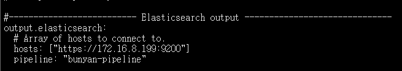
2. 定义`pipeline` Json文件，Json文件中用`grok`表达式定义提取字段
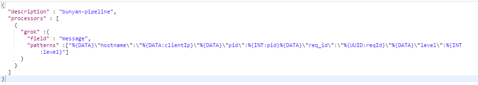
3. 在`elasticsearch`添加`pipeline`

    curl -H 'Content-Type: application/json' -XPUT 'http://localhost:9200/_ingest/pipeline/test-pipeline' -d@pipeline.json

4. 在`Kibana`中查看

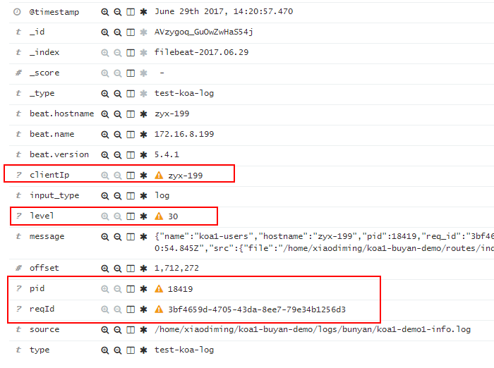

## 二、日志检索    
在`Discover`导航页，可进行日志检索。    
 
### 2.1 Time Filter  
右上方的时钟图标，用于根据多种相对及绝对时间段进行日志过滤，默认查询最近十五分钟数据。  
   
### 2.2 Search Bar  
位于主导航菜单下，用于搜索特定字段及/或完整消息
支持的查询语法有：  
* [query syntax](https://lucene.apache.org/core/2_9_4/queryparsersyntax.html)
* [Elasticsearch Query DSL](https://www.elastic.co/guide/en/elasticsearch/reference/5.4/query-dsl.html)   
    
简单用法：  
* 字符串全文检索  
检索框输入：`error`    
即：查询日志内文中含有error字符串的日志。    

* 字段查询    
输入：`type:“test-koa-log”`  
即：检索type属性值为test-koa-log的日志。  
   
* `AND` 
```  
type:test-koa-log AND message:"error"  
```      

* `NOT`    
```  
"jakarta apache" NOT "Apache Lucene"  
```  
包含 "jakarta apache" 但不包含"Apache Lucene" 。
  

* `Between`    
```  
mod_date:[20020101 TO 20030101]  
```  
* 通配符  
`te?t` 或  `test*` 或 `te*t`  
  
* 模糊匹配  
`roam~`能检索到`foam` 和 `roams`  

* 转义  
查询`logMsg`里面含有`/users/4566767y` :  
```  
logMsg:*\/users\/4566767y*  
```

### 2.3 Field Selector   
左侧搜索栏下方，用于选定`Log View`内显示的字段以进行修改。  
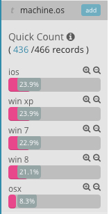    
* 点击要检索的属性，默认显示`top 5`的值
* 点击`+`可将此值作为全局过滤条件
* 点击`-`可设为全局不包含此值的过滤条件

## 三、特性监控-`Visualize`      
`Visualize`页面用于创建、修改及查看我们的定制化可视结果。其中包含多种可视类型，包括垂直柱状图、饼状图、活动地图（用于在地图上显示数据）以及数据表。可视结果还能够与访问Kibana实例的其他用户共享。  

### 3.1 默认可视化    
`kibana`基于`Beats`收集的日志信息，默认提供了很多内置视图：`Apache、Cassandra、Nginx、Memory、CPU、DNS、Docker、HTTP、MongoDB、Mysql、PgSQL、Redis`等等。  

常用的有：  
* `Visualize -> CPU usage over time`    
统计每30秒的cpu使用率(user与kernel进程的对比)  
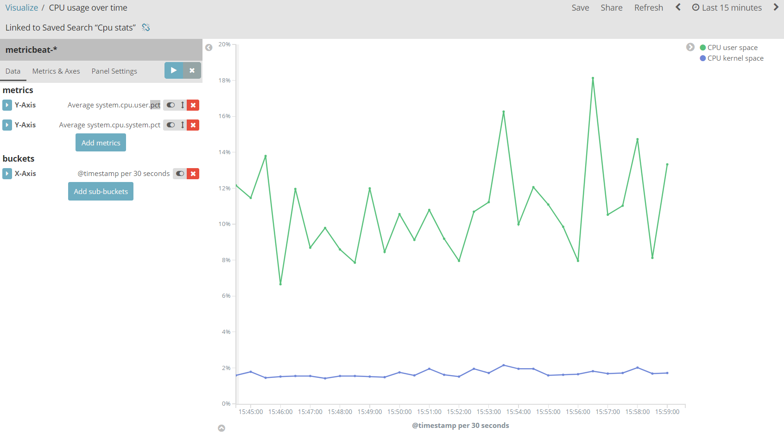  

* `Visualize -> CPU usage per process`      
统计各详细进程cpu使用率  
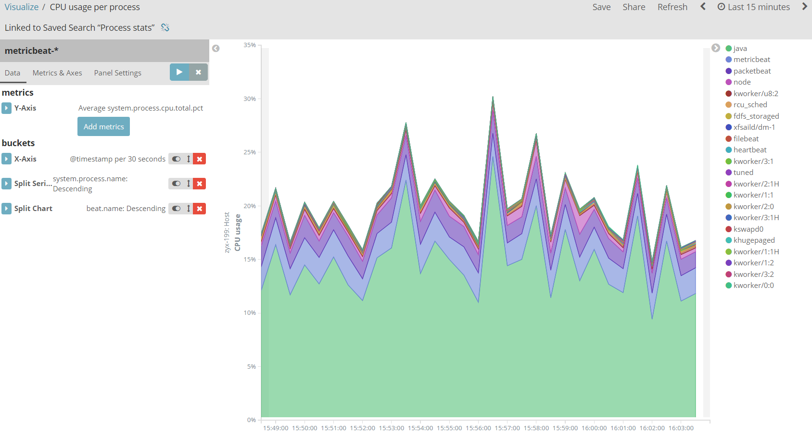    
   
* `Visualize -> Top processes by CPU usage`   
`Table`视图统计各详细进程cpu和内存使用率  
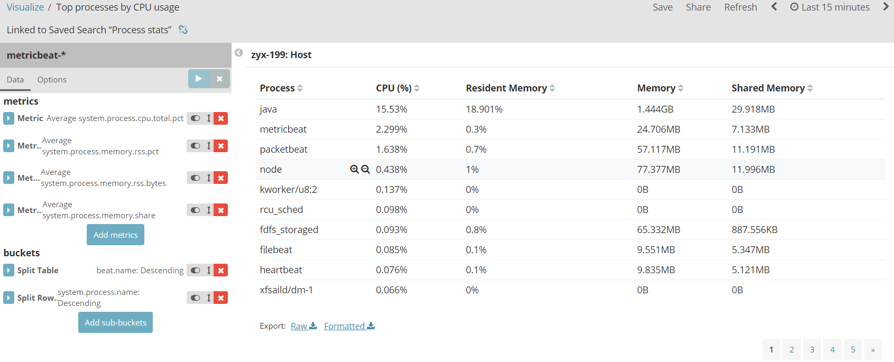    
 
* `Visualize -> Top disks by memory usage`   
统计磁盘空间占用情况：  
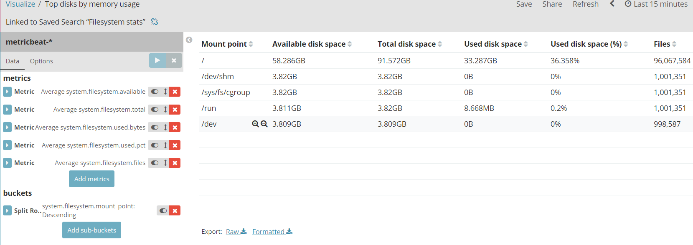    

* `Visualize -> Top hosts by memory usage`   
统计宿主机内存使用情况：  
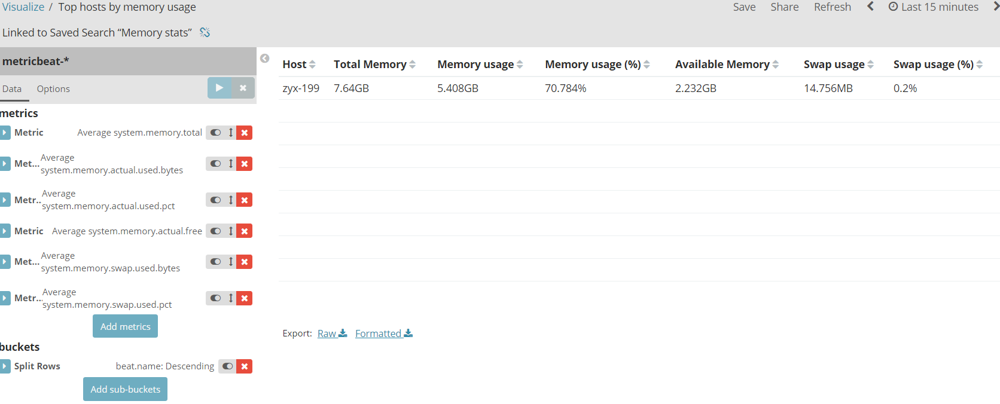  
 
* `Heartbeat HTTP pings`   
统计心跳响应情况：  
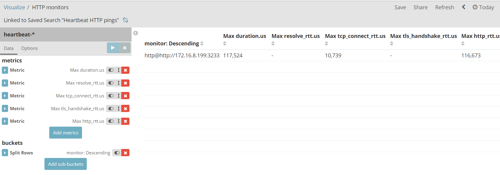  
  
* `Visualize -> HTTP codes for the top queries`    
统计http请求汇总状态码情况：  
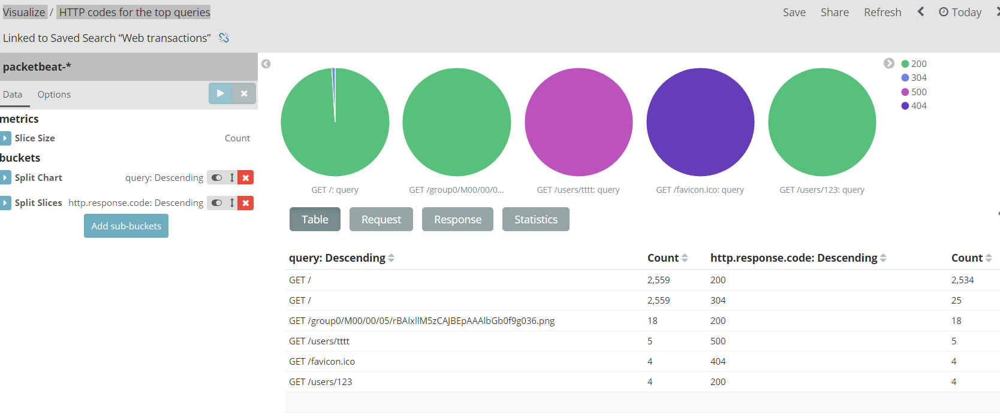  


### 3.2 自定义可视化视图  
比如这里建立一个`DataTable`查看：`http`请求的平均响应时间。  
* 新建 -> 选择`packetbeat-*`索引  
* 编辑 -> `metrics`    
添加平均响应时间、最大响应时间：  
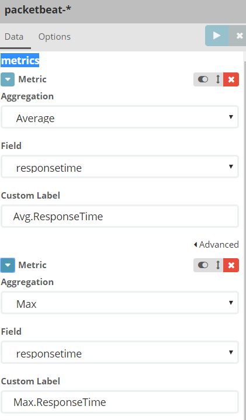    
* 编辑 -> `buckets`    
添加`ip、port、path`：  
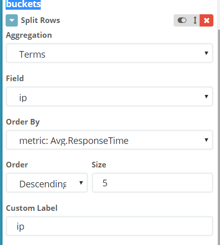   
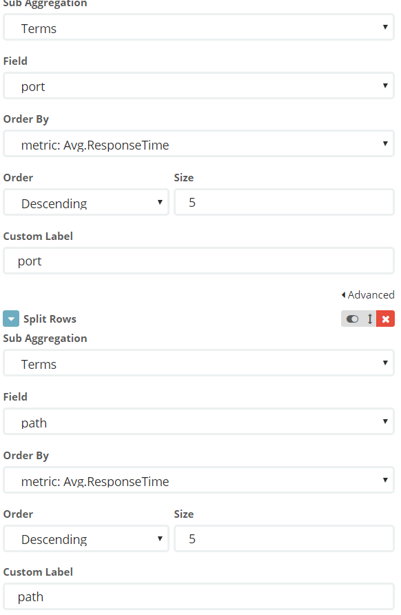    

* 执行后  
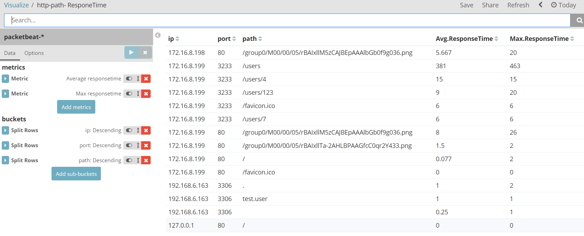      

* 保存为`custom-http-path-ResponeTime`   

### 3.3 自定义其他可视化视图  
* `custom-http-avg-resptime-pertime`    
指定端口每指定时间段内的平均响应时间。  

* `custom-request-count-pertime`  
指定端口每指定时间段内的请求次数。   

## 特性监控-Dashboard   
`Dashboard`主要用于整合`Visualize`可视结构，将多个`Visualize`经过组合后在单一也没进行呈现。  
`Dashboard`默认提供了一些仪表板，也可以让用户自定义/新增仪表板内容。  

## 特性监控-Timeline  

## 常用操作    

* 集群健康  
https://172.16.8.199:9200/_cat/health?v  
https://172.16.8.199:9200/_cluster/health
* 节点状态  
https://172.16.8.199:9200/_cat/nodes?v  
* 所有索引概况  
https://172.16.8.199:9200/_cat/indices?v