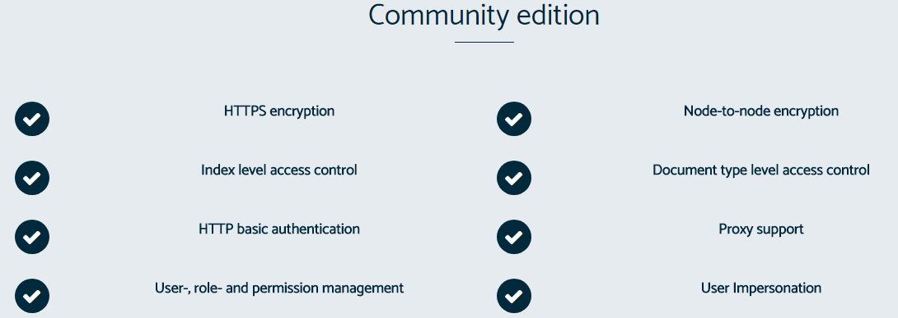
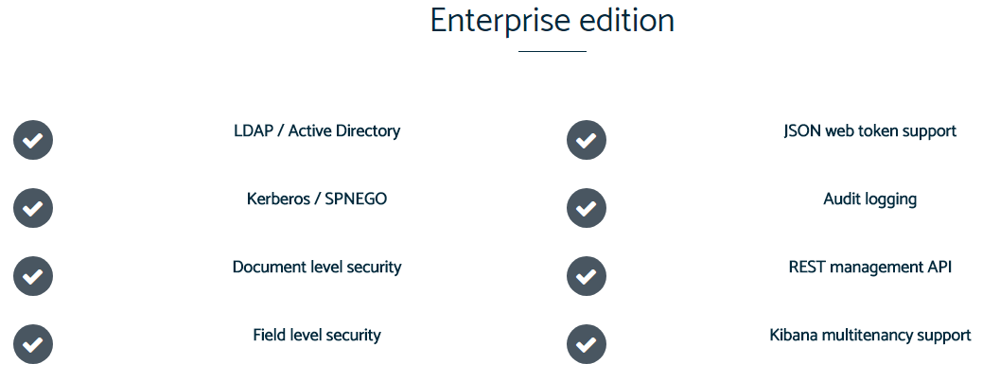

# Search Guard 5 安装配置 

* [官网地址](https://floragunn.com/)  
* [Github地址](https://github.com/floragunncom/search-guard)   
* [官方文档](https://floragunncom.github.io/search-guard-docs/)

> Search Guard® is an Open Source security suite for Elasticsearch and the entire ELK stack that offers encryption, authentication, authorization, audit logging and multi tenancy.
Whether you just want to encrypt data in transit, authenticate users against Active Directory, use Kerberos or JSON web tokens for Single Sign On or need to monitor and log malicious access attempts, Search Guard is your one-stop solution. And the best part is that the Community edition comes for free!    


## Search Guard 功能    

### 开源社区功能  
  

### 企业版功能    
  

 
## 安装配置    

### 1. Required    
* `Install Elasticsearch`  

### 2. 下载`search-guard`  
需要找到对应`Elasticsearch`版本的`search-guard`，如我们安装的版本为`Elasticsearch5.4.1`，则到[Version matrix](https://github.com/floragunncom/search-guard/wiki)  
找到对应的版本，进行[下载search-guard-5.4.1-12.zip](https://repo1.maven.org/maven2/com/floragunn/search-guard-5/5.4.1-12/)。  

### 3. 安装    
安装前，先停止`Elasticsearch`
```  shell
bin/elasticsearch-plugin install -b file:///path/to/search-guard-5-<version>.zip  
```  

### 4. 执行配置脚本     

* 初始化配置信息  
   
切换到`tools`目录，执行`./install_demo_configuration.sh` ,此脚本将对`elasticsearch.yml`添加默认的安全配置，以及生成默认的`TLS`证书。  

```  
$ cd into <ES directory>/plugins/search-guard-<version>/tools   
$ ./install_demo_configuration.sh 
```  

* 启动`Elasticsearch`    
* 执行`./sgadmin_demo.sh`  
此操作将在`Elasticsearch`内创建`Search Guard`的配置索引（使用的配置文件目录地址为：`/your-elastic/plugins/search-guard-<version>/sgconfig`）   
>   `sgconfig`文件夹下文件说明：
	- sg_config.yml: Configure authenticators and authorization backends  
	- sg_internal_users.yml: user and hashed passwords (hash with hasher.sh)  
	- sg_roles_mapping.yml: map backend roles, hosts and users to roles  
	- sg_action_groups.yml: define permission groups  
	- sg_roles.yml: define the roles and the associated permissions
	
* 测试访问  
访问：`https://localhost:9200`,会弹出用户名密码输入框，默认可使用`admin/admin`用户登录，拥有最高权限。  

### 5. SSL配置说明    
`Search Guard`支持的证书格式： 
* Keystores and truststores in JKS or PKCS12  
* X509 / PEM    

#### 1)使用`Demo certificate installation script`脚本生成
使用`install_demo_configuration`脚本生成的是 `keystore and truststore`证书，默认生成路径为`/usr/local/your-es/config`，并且添加了必要的配置信息到`elasticsearch.yml`文件。    
这种方式供demo方式使用，非常简单，不建议生产环境使用。   

#### 2)使用 TLS generator service生成    
由`Search Guard`提供的`TLS`生成服务，填写相关信息便可将相关信息发送到个人邮箱中
使用地址为：`https://floragunn.com/tls-certificate-generator/`   
> We have set up a web-based service to generate all required artefacts for you.   
You need to provide your email address and organisation name, and can specify up to 10 hostnames.   
The certificates, key and truststore files are generated in the background. Secure Guard will send you a download link once everything is ready.
Your email is necessary to send you the download link, while the organisation name will become part of the generated root CA.   
Please use only letters, digits, hyphens and dots for the hostname.

#### 3)使用Using the example PKI scripts生成      
结合实际情况，一般会选择这种方式。
PKI 实例脚本，要求必须安装OpenSSL且版本至少为`1.0.1k`（经验证`1.0.1e`貌似也没问题）。   
* 下载[search-guard-ssl-5](https://github.com/floragunncom/search-guard-ssl/releases)    
下载的版本为：`search-guard-ssl-ves-5.4.1-22.tar.gz`,进行解压即可。在`example-pki-scripts`目录中即为相对应的脚本。
* 执行`example.sh`生成证书
当前执行目录会生成所有需要的证书。   
> 如果由于任何原因需要重新执行脚本，在同一目录中执行`./clean.sh`，即可自动删除所有生成的文件。
  
将会生成以下证书：  
* `truststore.jks`。    
The truststore containing the root CA and a signing CA used to sign all other certificates.    
* `keystore.jks`     
`node-0-keystore.jks, node-0-keystore.jks, node-2-keystore.jks`
Keystores containing node certificates. These certificates can be used on all Elasticsearch nodes.
* `kirk-keystore.jks`    
Keystore containing a client certificate. In the sample configuration files, this certificate is configured to be an admin certificate.  
* `spock-keystore.jks`  
Keystore containing a regular, non-admin client certificate.  

#### 复制证书到elasticsearch目录  
在每个节点上，将keystore.jks和truststore.jks文件放在运行Elasticsearch的用户可读的目录中，这里放在了Elasticsearch的配置文件目录中。并且给予Elasticsearch用户读取文件权限。keystore.jks在每个节点上是特定的。


修改`elasticsearch.yml`添加以下内容：  
```  yaml
######## Start Search Guard Demo Configuration ########
searchguard.ssl.transport.keystore_filepath: keystore.jks  #keystore文件位置
searchguard.ssl.transport.truststore_filepath: truststore.jks   #truststore文件位置
searchguard.ssl.transport.enforce_hostname_verification: false  #是否开启证书内hostname验证
searchguard.ssl.http.enabled: true						#设置可开启或关闭ssl认证
searchguard.ssl.http.keystore_filepath: keystore.jks   #keystore文件位置
searchguard.ssl.http.truststore_filepath: truststore.jks   #truststore文件位置
searchguard.authcz.admin_dn:  # 管理证书的组织结构
  - CN=kirk,OU=client,O=client,L=test, C=de

cluster.name: searchguard_demo
network.host: 0.0.0.0
######## End Search Guard Demo Configuration ######## 
```        
> 每个Elasticsearch节点使用不同的密钥库文件（node-0-keystore.jks）

### 6. Http basic相关配置    
`Search Guard`安装配置完成后，默认已集成`Http Basic`认证。  
在`/your-elastic/plugins/search-guard-5/sgconfig/sg_config.yml`文件：  
其中`Http basic`的配置节：  
```  
basic_internal_auth_domain: 
        enabled: true
        order: 4
        http_authenticator:
		  # Http basic验证方式
          type: basic
		  # 当认证失败时的响应方式：参见下方说明
          challenge: true
        authentication_backend:
		  #使用searchguard内置用户数据
          type: intern  
  
```   
> In most cases, you will want to set the challenge flag to true. The flag defines the behaviour of Search Guard, if the Authorization field in the HTTP header is not set:
If challenge is set to true, Search Guard will send a response with status UNAUTHORIZED (401) back to the client, and set the WWW-Authenticate header to Basic realm="Search Guard". If the client is accessing the Search Guard secured cluster with a browser, this will trigger the authentication dialog and the user is prompted to enter username and password.
If challenge is set to false, and no Authorization header field is set, Search Guard will not sent a WWW-Authenticate response back to the client, and authentication will fail. You may want to use this setting if you have another challenge http_authenticator in your configured authentication domains (Note that there can only be one challenge authenticator). One such scenario is when you plan to use Basic Authentication and Kerberos together, and set Kerberos to challenge: true. In that case, you can still use Basic Authentication, but only with pre-authenticated requests  
  
### 7. 修改默认用户密码  
安装`Search Guard`后，内置初始化了很多用户，修改默认密码方式如下：  
如将`admin`用户的密码修改为`123456`：  
```  
$ cd /your-elasticsearch/plugins/search-guard-5/tools/hash.sh -p 123456
```  
将生成的密码拷贝后，打开`sg_internal_users.yml`文件，替换`admin`对应的`hash`值即可：  
```  
admin:
  hash: $2a$12$VcCDgh2NDk07JGN0rjGbM.Ad41qVR/YFJcgHp0UGns5JDymv..TOG
  #password is: admin
```    

* 启动·Elasticsearch`    
* 执行`./sgadmin_demo.sh`导入配置  


### 8. 新增Search Guard用户  
如果我们不想使用`Search Guard`默认的用户，需要新增用户`upadmin`,密码`upchina123`，并赋予最高权限:  
* 按`步骤7`的方式先生成密码的`hash`值 
* `sg_internal_users.yml`内添加用户    
```  
upadmin:
  hash: $2a$12$.uB9dFHIc1yDfVrfeSCLlOVP42QitL3LYrOrMY99NK34YPm860rP.
  #password is: upchina123  
```  
* `sg_roles_mapping.yml`内赋予管理员权限   
 
```  
sg_all_access:
  users:
    - admin
    - upadmin
```    

* 启动·Elasticsearch`    
* 执行`./sgadmin_demo.sh`导入配置  
  
### 9. 客户端访问`Elasticsearch`  
将服务端生成的example-pki-scripts/ca/root-ca.crt证书拷贝到客户端，安装后访问：`https://node-0.example.com:9200/`  （注意：需要域名解析配置）    

### 10. `kibana`配置  
Elasticsearch启用SSL认证后，对应修改`kibana`的配置：  
  
```  
# The URL of the Elasticsearch
# 启动时如果无法连接，可将localhost改为ip。应该是由于集群的hosts配置原因。
elasticsearch.url: "https://127.0.0.1:9200"    

# If your Elasticsearch is protected with basic authentication, these settings provide
# the username and password that the Kibana server uses to perform maintenance on the Kibana
# index at startup. Your Kibana users still need to authenticate with Elasticsearch, which
# is proxied through the Kibana server.
elasticsearch.username: "admin"
elasticsearch.password: "admin" 

# To disregard the validity of SSL certificates, change this setting's value to 'none'.
#elasticsearch.ssl.verificationMode: full
elasticsearch.ssl.verificationMode: none  
#elasticsearch.ssl.certificate_authorities: ["/usr/local/elk/elasticsearch/search-guard-ssl-ves-5.4.1-22/example-pki-scripts/ca/root-ca.pem"]
``` 

### 11. `filebeat`配置  

```  
output.elasticsearch:
  # Array of hosts to connect to.
  # 启动时如果无法连接，可将localhost改为ip。应该是由于集群的hosts配置原因。
  hosts: ["https://localhost:9200"]

  # Optional protocol and basic auth credentials.
  #protocol: "https"
  username: "admin"
  password: "admin"
  
  #ssl.certificate_authorities: ["/usr/local/elk/elasticsearch/search-guard-ssl-ves-5.4.1-22/example-pki-scripts/ca/root-ca.pem"]
  # 如果是自签名证书，可设置为none，即不验证服务器证书
  ssl.verification_mode: none
```


